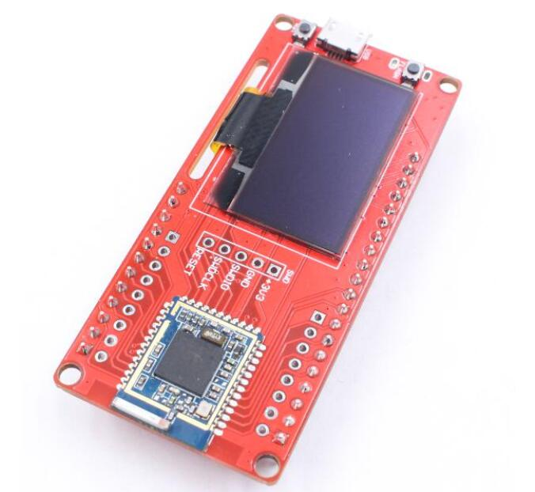

# MakePython nRF52840

```c++
/*
Version:		V2.0
Author:			UNKOWN
Create Date:	UNKOWN
Note:
	2020/7/24	v2.0: Rebuid readme,add pic. By Vincent
*/
```

[toc]

# Introduce

Python is one of the most widely used, simple and easy-to-learn programming languages around. CircuitPython is a lean implementation of the Python 3 programming language that has been pared down to run efficiently on microcontrollers.
MakePython nRF52840 is a powerful, generic BLE MCU module target to CircuitPython/MicroPython learners & developers. It is true “breadboard compatible”, with the very detailed pins explanation, it is easy to learn& use. The nRF52840 is ready to take advantage of the considerable performance improvements for Bluetooth Low Energy (LE) with the arrival of the Bluetooth 5 specification. Of greatest importance is the support for longer range (up to x4 compared to Bluetooth 4.x) and doubling of on-air data rate, up to 2 Mbs from 1 Mbs in Bluetooth 4.x
The MakePython nRF52840 leads out all pins of Nordic nRF52840, is programmed with CircuitPython by default, users can begin the CircuitPython developing as getting then on hand. It is also compatible with the Arduino making it easy to get started if the correct bootloader downloaded. There also the Makerfabs MakePython ESP8266, MakePython ESP32 and so on.



- You can get one from: [MakePython_nRF52840](https://www.makerfabs.com/makepython-nrf52840.html)

- Hardware and detailed instructions please visit Wiki page: [MakePython_nRF52840 Wiki](https://www.makerfabs.com/wiki/index.php?title=MakePython_nRF52840)

# Related Test

Visit the wiki for details.

- Display animation


- bluetooth communication


